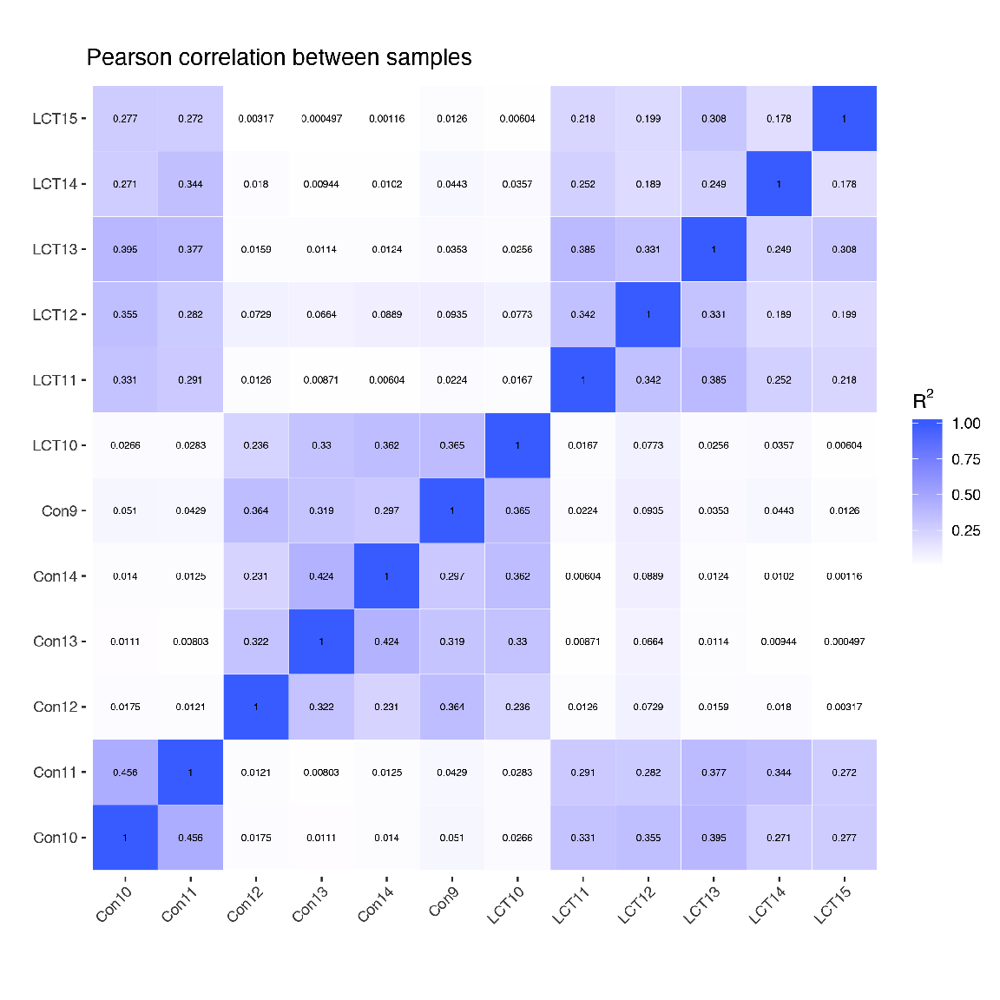

Pearson correlation between samples 相关性画图
================
November 13, 2018

Pearson correlation between samples
-----------------------------------

-   准备各样本的基因表达量数据
-   安装包

使用R package "ggplot2" 和 "reshape2" 画图；

注："\#"号代表注释行，即不运行；运行R scripts前，需确保所依赖包都已安装完成。

``` r
# install.packages('ggplot2')

# install.packages('reshape2')
```

-   画图

只需将数据格式整理为test.data (txt格式)替换即可；

``` r
library(png)
library(grid)
library(gridExtra)

# R package "png"/"grid"/"gridExtra"只是为了在该R markdown展示生成的图所使用的包；
# 在RStudio中只需运行 
# source('corr_fpkm_plot.r')
# corr_plot("test.data")
# 即可出结果；

if("cor_pearson.png" %in% dir("./corr_plot/") ){
  
  img <- rasterGrob(as.raster(readPNG(paste0("corr_plot/cor_pearson.png"))), interpolate = FALSE)
  grid.newpage()
  grid.arrange(img, ncol = 1)
  
}else{
  source('corr_fpkm_plot.r')
  corr_plot("test.data")
  
  img <- rasterGrob(as.raster(readPNG(paste0("corr_plot/cor_pearson.png"))), interpolate = FALSE)
  grid.newpage()
  grid.arrange(img, ncol = 1)
}
```


<p class="caption">
Fig 1. Pearson correlation plot
</p>

-   结果

在该目录下生成corr\_plot文件夹，包含cor\_pearson.png、cor\_pearson.pdf和cor\_pearson.xls三个文件，表格为样本间相关性，其余为热图展示。
