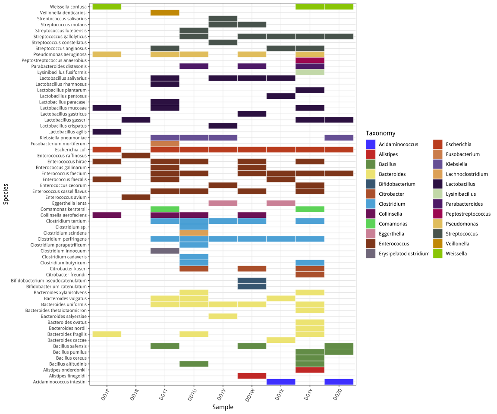

Heatmap examples by ggplot2
================
November 14, 2018

Heatmap
-------

-   安装包

使用R package "ggplot2"画热图，需要先安装package;

``` r
# install.packages('ggplot2')

# install.packages('ggsci')
```

注："\#"号代表注释行，即不运行；运行R scripts前，需确保所依赖包都已安装完成。

-   画图

只需将数据格式整理为data.csv格式(tab格式)替换即可；

``` r
library(ggplot2)
library(ggsci)

df <- read.csv("data.csv", header = T, stringsAsFactors = F, sep = '\t')
colnames(df) <- c('Sample', 'Taxonomy', 'Species', 'Number')

p <- ggplot(df, aes(Sample, Species)) + geom_tile(aes(fill = Taxonomy), colour = 'white', size = 0.25)
p + theme_bw() + theme(axis.text.x = element_text(angle = 60, hjust=1), 
                       axis.text.y = element_text(size = 8)) + scale_fill_igv()
```


