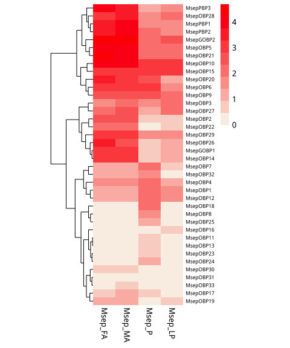

Heatmap examples
================
November 13, 2018

Heatmap
-------

-   安装包

使用R package "pheatmap"画热图，需要先安装package; 安装参考https://github.com/raivokolde/pheatmap；

``` r
# install.packages('pheatmap')
```

注："\#"号代表注释行，即不运行；运行R scripts前，需确保所依赖包都已安装完成。

-   画图

只需将数据格式整理为OBP.fpkm格式(txt格式)替换即可；

``` r
library(pheatmap)

union=read.table("OBP.fpkm",header = T)
rownames(union)<-union[,1]
union<-union[,-1]
union<-log10(union + 1)

if(length(union[,1])<=50){
  showname=TRUE;
}else{
  showname=FALSE;
}
if(length(union[1,])<=10){
  cell_widths=30
  cell_width=28
}else{
  cell_widths=floor(360/length(union[1,]))
  cell_width=floor(300/length(union[1,]))
}
num=length(union[,1])
if(dim(union)[2]==2){
  scale_row_col="column"
}else{
  scale_row_col="row"
}

pheatmap(union, color=colorRampPalette(rev(c("red", "linen")))(10), legend=T,show_rownames=TRUE,fontsize_row=6.5, cellwidth=cell_width, cluster_rows =T,cluster_cols = F,border_color = NA)
```


<p class="caption">
Fig 1. Heatmap figure
</p>
